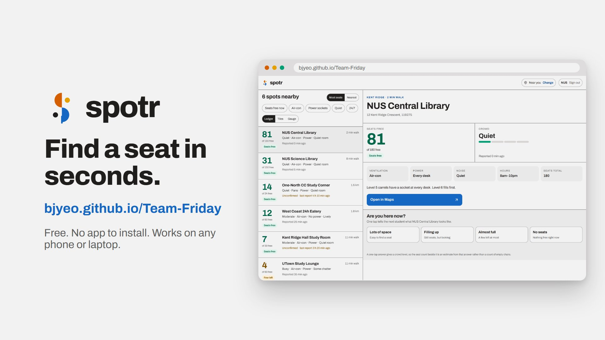

# Spotr

Live seat counts and crowd levels for public study spots in Singapore, reported by the
students already sitting in them.

**Live:** https://bjyeo.github.io/Team-Friday/

Students who study outside home search Google Maps, travel twenty minutes, and arrive to
find every seat taken. Spotr answers "is there a seat, right now" before the trip.

## Demo

[](https://bjyeo.github.io/Team-Friday/spotr-demo.mp4)

**[▶ Watch the 45-second demo](https://bjyeo.github.io/Team-Friday/spotr-demo.mp4)**: sign in, find spots near you, filter,
check a spot, and report how full it is with one tap. The app screens are real captures of
the live site. The video is built with [Remotion](https://www.remotion.dev) in [`video/`](video/).

## Running it

```bash
npm install
npm run dev        # http://localhost:5173/Team-Friday/
npm test           # 71 tests over the core logic
npm run build      # typecheck + production bundle
```

Sign in with any Singapore university or polytechnic address — `e1234567@u.nus.edu`,
`s1234567@np.edu.sg`. Nothing is sent anywhere; the address is checked against a list in
the browser.

## What it does

| User story | Where |
| --- | --- |
| Browse spots near me or near a place I type | `pages/LocationPage.tsx`, `context/PlaceContext.tsx` |
| See seats, crowd level and how long ago it was reported | `lib/spotState.ts`, `lib/freshness.ts` |
| Filter by air-con, power, noise and 24/7 | `lib/filters.ts` |
| Tap one button on arrival to report how full it is | `components/ReportSheet.tsx` |
| Open the spot in my maps app | `components/SpotDetail.tsx` |

Twelve spots are seeded by hand around Kent Ridge, Clementi and the city, with real
coordinates so distance and radius-widening behave the way they will against any later
data source.

### When things go wrong

Each of these is a path through the UI, not a crash:

- **Location denied** → falls back to the area/postcode box, with the reason named.
- **Nothing within 2 km** → widens to 10 km and says it did.
- **Every report stale** → the spot is shown and labelled *Unconfirmed*, never dressed up
  as fresh. Staleness starts at three hours (`STALE_AFTER_MINS`).
- **No reports at all** → the card appears with `—` seats and crowd *No data*. A crowd
  level is never guessed.
- **Report fails to send** → kept on the device, a banner says it was not saved, and it
  retries (`lib/storage/reportQueue.ts`).

## Measuring it

The canvas's primary outcome metric is time from opening the site to choosing a spot.
"Choosing" is recorded when a student taps through to Maps. Read a test session's numbers
from the browser console:

```js
spotrMetrics()
// { measurements: [...], medianSecondsToChoose: 41.2 }
```

The target is 8 of 10 students under two minutes. The guardrail — no more than 1 in 5
cards showing information older than three hours — is measured by `staleFraction()` and
enforced in the UI by labelling every stale card.

## Why there is no database

The constraints were: free, no signups, hosted on GitHub Pages. GitHub Pages serves static
files only, and every hosted database worth using (Supabase, Firebase, Neon, Planetscale)
requires an account. So reports live in `localStorage`.

**This means reports do not travel between devices.** One student's tap does not reach the
next student's phone. That is a real limitation of this build, and it is the one thing
that would have to change before the self-reporting assumption can actually be tested with
more than one person at a time.

Everything above `lib/storage/adapter.ts` talks to the `StorageAdapter` interface, and
every method is already async. Swapping in a real backend means writing one class and
changing one line in `lib/storage/index.ts`:

```ts
export function createStorage(): StorageAdapter {
  return new LocalStorageAdapter(safeLocalStorage())  // ← this line
}
```

The retry queue, the optimistic update and the "not saved" banner are all in place for the
day that write goes over a network.

## Sign-in

Out of scope in the canvas, requested afterwards. It is a **client-side gate, not
authentication**: the email connector (`lib/schoolEmail.ts`) checks the domain against a
list of Singapore universities and polytechnics, exact or by subdomain, so `u.nus.edu`
passes and `nus.edu.attacker.com` does not. There is no password and no server, so it
keeps honest people honest and labels reports — it does not prove anyone is a student.
Adding a school is one row in `SCHOOLS`.

## Layout

```
src/
├── data/spots.ts           seeded spots and named places
├── lib/
│   ├── schoolEmail.ts      the email connector
│   ├── freshness.ts        staleness rules and labels
│   ├── spotState.ts        joins a spot to its freshest report
│   ├── filters.ts          filters, sorts, radius widening
│   ├── viewModel.ts        display strings and status colours
│   ├── metrics.ts          time-to-choose measurement
│   └── storage/            adapter, localStorage impl, retry queue, seed
├── context/                auth, reports, chosen place
├── components/             header, list (3 layouts), detail, report sheet
├── pages/                  login, location, browse
└── styles/tokens.css       the Modernist design tokens
```

Design tokens and all three card layouts (Ledger, Tiles, Gauge) come from the UI mockup;
the layout switcher in the list header lets you see each one.

The logo is drawn as inline SVG in `components/Logo.tsx` rather than imported, so it stays
sharp at any size and takes its four colours from the palette tokens. The source artwork is
in `design/`.

## Deployment

Pushing to `main` runs tests, builds, and publishes to GitHub Pages
(`.github/workflows/deploy.yml`). Routing uses `HashRouter` so deep links survive static
hosting without a 404 shim. A fork under a different repo name needs `VITE_BASE` set to
`/<repo-name>/`.
